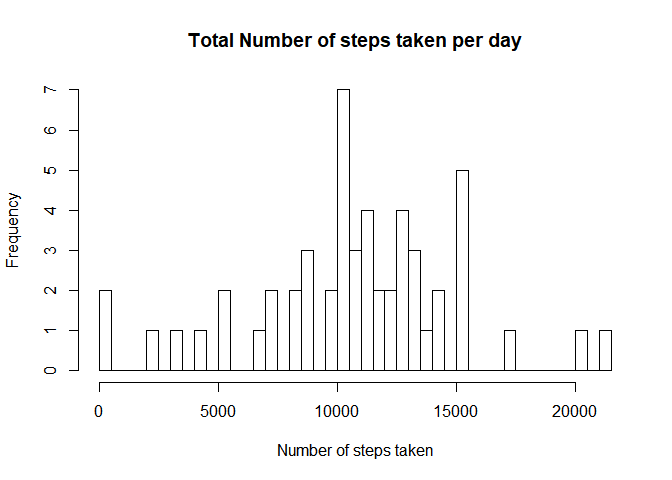

Setting echo=TRUE so that we are able to view the code chunks

    knitr::opts_chunk$set(echo = TRUE)

Loading and preprocessing the data
----------------------------------

Reading the data and formatting the date column as Date.

    setwd('C:/Users/320089162/Downloads/RepData_PeerAssessment1-master/RepData_PeerAssessment1-master/activity')
    data=read.csv('activity.csv', stringsAsFactors = FALSE)
    data$date=as.Date(data$date)

What is mean total number of steps taken per day?
-------------------------------------------------

Ignoring the missing values for now. Then, plotting a histogram of the
total number of steps taken per day.

    data_ignoring_nas=data[!is.na(data$steps),]
    totalsteps=aggregate(steps~date,FUN=sum,data=data_ignoring_nas)
    hist(totalsteps$steps,breaks = 50,xlab = "Number of steps taken", main = "Total Number of steps taken per day")

Finally, finding the mean and median of total steps taken per day.

    mean(totalsteps$steps)

    ## [1] 10766.19

    median(totalsteps$steps)

    ## [1] 10765

What is the average daily activity pattern?
-------------------------------------------

Plotting the average steps taken averaged over all days in each 5-minute
interval.

    meanstep=aggregate(steps~interval,data=data_ignoring_nas,mean)
    plot(meanstep$interval,meanstep$steps,type='l', xlab = "5-minute interval", ylab = "No. of steps taken", main= "Average steps taken in each 5-minute interval")

Displaying the 5-minute interval when the maximum steps were taken.

    meanstep[which(meanstep$steps==max(meanstep$steps)),]$interval

    ## [1] 835

Imputing missing values
-----------------------

Displaying number of records having missing values.

    sum(is.na(data))

    ## [1] 2304

Replacing the missing values with the mean steps in that 5-minute
interval.

    newdata=data
    for (i in 1:17568)
    {
         if(is.na(data[i, 1])==TRUE) 
           {
            data[i, 1] <- meanstep[meanstep$interval %in% data[i,3], 2]
        }
    }

Redoing the plot and the mean and median of total steps taken per day.
As, we can observe the difference is very less as we imputed the missing
values with the mean steps in a particular 5-minute interval.

    totalsteps=aggregate(steps~date,FUN=sum,data=newdata)
    hist(totalsteps$steps,breaks = 50,xlab = "Number of steps taken", main = "Total Number of steps taken per day")

    mean(totalsteps$steps)

    ## [1] 10766.19

    median(totalsteps$steps)

    ## [1] 10765

Are there differences in activity patterns between weekdays and weekends?
-------------------------------------------------------------------------

We create a new variable which tells us whether the day on a particular
date was a weekday or a weekend. We make this new variable a factor,
which has only 2 levels- weekday and weekend.

    for(i in 1:17568)
    {
    if(weekdays(newdata$date[i])=="Saturday"| weekdays(newdata$date[i])=="Sunday")
    {
      newdata$factor[i]='weekend'
    }
    else
    {
       newdata$factor[i]='weekday'
    }
    }
    newdata$factor=as.factor(newdata$factor)

Finally, we plot the average of steps taken in a particular 5-minute
interval on weekdays and weekends separtely.

    weekdata=newdata[which(newdata$factor=='weekday'),]
    weekenddata=newdata[which(newdata$factor=='weekend'),]
    meanweekstep=aggregate(steps~interval,data=weekdata,mean)
    meanweekendstep=aggregate(steps~interval,data=weekenddata,mean)
    par(mfrow=c(2, 1), mar=c(4,4,2,1))
    plot(meanweekstep$interval,meanweekstep$steps,type='l',xlab = "5-minute interval", ylab = "No. of steps taken", main= "Weekdays")
    plot(meanweekendstep$interval,meanweekendstep$steps,type='l',xlab = "5-minute interval", ylab = "No. of steps taken", main= "Weekends")

